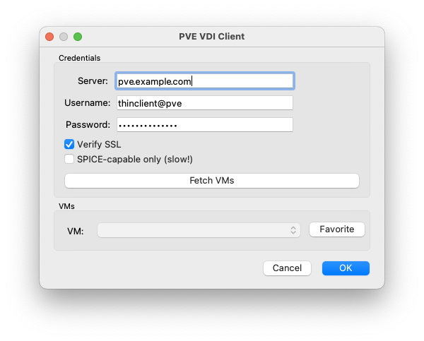

# PVE SPICEy GUI (pve-vdi-client[-gui])
PVE SPICEy GUI (or as it is on the command line, `pve-vdi-client` and `pve-vdi-client-gui`) is a command line and graphical interface for connecting to hosts leveraging SPICE in Proxmox Virtual Environments.

## Features

### GUI

#### Cross-platform Graphical Interface 
Leveraging Qt and PySide2, PVE SPICEy GUI provides a cross-platform graphical interface for connecting to hosts.



#### Favorites
For those with large deployments, you can add/remove various VMs as favorites for quick access.

#### Config Persistence
The GUI and CLI leverage the same config file format interchangeably. Set it once in your home directory `~/.pve_vdi_client.cfg` and you're done! (see 'Configuration' below)

#### VM Filtering
Since this client is specifically for connecting to SPICE clients, you might need to filter out those that don't have the functionality. This client will let you do that (at a potentially steep time cost of execution).

# Installation

## Prerequisites (virt-viewer/remote-viwer)
You **must** have remote-viewer installed on your system in order to use this. Consult with the [Spice Space](https://www.spice-space.org/download.html) page for more details.

### Windows
The [virt-manager](https://virt-manager.org/download/) package should have the remote-viewer executable.

### Linux
Often times, you can install this through your distro's default package manager by installing `virt-manager` (e.g. `apt install virt-manager`)

### Mac OS X (Homebrew)
Officially, virt-viewer doesn't work the way it needs to on the Mac, but there's a way to get it limping along (with occasional crashes). [Check out this repo](https://github.com/jeffreywildman/homebrew-virt-manager) for instructions on how to install.

## General Installation (See "Development" below)
Run the following command to install the executables for the client and GUI:

```
pip install -r requirements.txt
pip install .
```

Now you can run the following:

```
# CLI
pve-vdi-client <pve_vmid>
# GUI
pve-vdi-client-gui
```

## Raspberry Pi
To run this on Raspberry Pi, you need to actually use system python and pip to install the PySide2 package. To do this, run the following command:

```
sudo apt install python3-pyside2.qtgui
```

Then, you'll need to remove/comment out the PySide2 requirement in the `pyproject.toml`. I know this is crappy, but 🤷‍♂️.

```
...
    "proxmoxer==1.2.0",
    # YOU NEED THIS, but requiring it on RPi causes errors.
    # "PySide2==5.15.2.1",
    "python-decouple==3.6",

...
```

Now you can run the following to install:

```
# It will error out on PySide2, but that's fine since you've installed it system-wide.
pip install -r requirements.txt
pip install .
```

If you're planning on wanting to hear things from your VMs over SPICE when on the RPi, make sure you install the following packages. Otherwise, audio will not work:

```
sudo apt install pulseaudio gstreamer1.0-pulseaudio gstreamer1.0-alsa
```

# Configuration
There are two locations in which the application will look for configurations (in order):
1. `~/.pve_vdi_client.cfg`
1. `.pve_vdi_client.cfg`

For information about what configuration parameters are allowed and what they mean, check out the `.pve_vdi_client.cfg.example` file at the root of this project. **It is important to note that changes to configuration that are made in the GUI will be applied to thie configuration when VMs are fetched.**

# Development
## Getting started

Run the following to get things set up:

```
python -m venv env
source env/bin/activate
pip install -r requirements.txt
pip install --editable .
```

If you want to run the cli or gui, run the following:

```
python -m pve_vdi_client <pve_vmid>
python -m pve_vdi_client.vdi_gui.gui
```

Have fun!

## Publishing
To publish packages to your own PyPi instance, you'll need to have a .pypirc file configured. If you need help with that, check out [this guide](https://packaging.python.org/en/latest/specifications/pypirc/). First off, build the distributable packages:

```
python -m build
```

Once the package is built, you should have both an archive and wheel package in the `dist/` directory. Now, run the following command to upload it to the relevant repo:

```
twine upload --config-file .pypirc --repository homelab-pip dist/pve_vdi_client-0.0.2-py3-none-any.whl
```